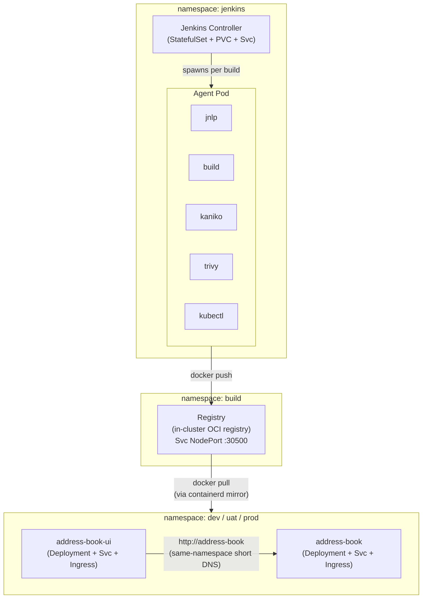

# Jenkins Kube Reference

Production-adjacent Jenkins on Kubernetes via the official [jenkinsci/jenkins](https://github.com/jenkinsci/helm-charts) Helm chart, with ephemeral Kaniko agents building the [address-book](https://github.com/jasoncalalang/address-book) and [address-book-ui](https://github.com/jasoncalalang/address-book-ui) sample apps.

The Kubernetes-native sibling to [jenkins-reference](https://github.com/jasoncalalang/jenkins-reference) (which uses docker-compose). Same sample apps, different deployment model, different lessons.

## What this teaches

- Running Jenkins on Kubernetes the modern way — Helm chart + JCasC, no clicking
- Ephemeral agent pods via the Jenkins Kubernetes plugin (fresh pod per build)
- Building container images *inside* a pod with **Kaniko** — no Docker-in-Docker hack, no privileged containers, no `/var/run/docker.sock` mount
- **Container image vulnerability scanning** with **Trivy** — shift-left security gating that fails builds on CRITICAL/HIGH CVEs and publishes an HTML report to the Jenkins sidebar
- Pushing to an in-cluster OCI registry and pulling the same image back
- Deploying the built image to the same cluster it was built on
- **PVC-based build caches** for Gradle and Trivy — ephemeral pods, persistent caches

## Architecture



## Branching & promotion

Both [`address-book`](https://github.com/jasoncalalang/address-book) and [`address-book-ui`](https://github.com/jasoncalalang/address-book-ui) follow a three-branch promotion model:

| Branch | Deploys to namespace | Hostname pattern |
|---|---|---|
| `dev`  | `dev`  | `<app>.dev.lan` |
| `uat`  | `uat`  | `<app>.uat.lan` |
| `main` | `prod` | `<app>.prod.lan` |

`main` is the **production** tip. New work lands on `dev` (commits or merged PRs targeting `dev`). Promotion is just a git fast-forward merge:

```bash
# dev → uat
git checkout uat && git merge --ff-only dev && git push

# uat → main (= prod)
git checkout main && git merge --ff-only uat && git push
```

Each push triggers the matching multibranch sub-job in Jenkins, which builds + deploys to the target environment. Branches outside `{main, uat, dev}` (e.g. feature branches, PR branches) build and push images to the registry but skip the Deploy + Health Check stages — useful as a CI sanity check without risking deployment side-effects.

Image tags include the environment for traceability:

```
registry.build.svc.cluster.local:5000/address-book:dev-42
registry.build.svc.cluster.local:5000/address-book:uat-7
registry.build.svc.cluster.local:5000/address-book:prod-3
```

In Jenkins this manifests as a **Multibranch Pipeline** project per repo (`address-book`, `address-book-ui`). Open the project to see one sub-job per branch with independent build histories.

The per-environment kustomize overlays live alongside the source in each repo:

```
k8s/
├── base/                # shared Deployment, Service, Ingress (no namespace, placeholder host)
└── overlays/
    ├── dev/             # namespace: dev, host: <app>.dev.lan
    ├── uat/             # namespace: uat, host: <app>.uat.lan
    └── prod/            # namespace: prod, host: <app>.prod.lan
```

The Deploy stage in `Jenkinsfile.kube` does `kubectl apply -k k8s/overlays/${ENV_NAME}` where `ENV_NAME = (BRANCH_NAME == 'main') ? 'prod' : BRANCH_NAME`.

## Per-developer environments

Beyond the three shared environments (`prod`, `uat`, `dev`), the setup ships with two extra slots — `dev2` and `dev3` — that you can hand out to individual developers. Each is fully isolated: its own namespace, its own pair of `Deployment` + `Service` + `Ingress` for both apps, its own image tags.

| Branch | Namespace | Hostnames |
|---|---|---|
| `dev2` | `dev2` | `address-book.dev2.lan`, `address-book-ui.dev2.lan` |
| `dev3` | `dev3` | `address-book.dev3.lan`, `address-book-ui.dev3.lan` |

Developer A creates branch `dev2` from `dev` (or wherever) in either app repo, pushes, and Jenkins picks it up on the next scan and deploys it to the `dev2` namespace. Developer B does the same on `dev3`. Neither steps on `prod`/`uat`/`dev` or on each other.

### Adding a fourth developer environment ("dev4")

Four files across three repos. Look for the `// Per-developer environments` comment block in each — it's the recipe.

1. **`jenkins-kube-reference/values.yaml`** — append `dev4` to BOTH `includes(...)` strings inside the multibranch seed jobs:
   ```diff
   - includes('main uat dev dev2 dev3')
   + includes('main uat dev dev2 dev3 dev4')
   ```
2. **`address-book/Jenkinsfile.kube`** — add `branch 'dev4'` to BOTH `when` blocks (Deploy and Health Check). Same in **`address-book-ui/Jenkinsfile.kube`**.
3. **`address-book/k8s/overlays/`** — copy the example:
   ```bash
   cp -r k8s/overlays/dev2 k8s/overlays/dev4
   sed -i '' 's/dev2/dev4/g' k8s/overlays/dev4/kustomization.yaml
   ```
   Same in **`address-book-ui/k8s/overlays/`**.
4. **Helm-upgrade Jenkins** so the new `includes(...)` reaches the controller, then push the dev4 branch to one of the app repos and watch the multibranch project pick it up. The pipeline auto-creates the `dev4` namespace on first deploy.

That's it — five `git push`es and one `helm upgrade`.

### Removing a developer environment

**This part is intentionally manual.** Jenkins' multibranch pipeline can auto-clean its own jobs when a branch is deleted (`orphanedItemStrategy.discardOldItems`), but it does NOT touch the deployed Kubernetes resources. If you delete the `dev2` git branch and the `dev2` overlay, the `dev2` namespace and everything inside it stays running until someone deletes it.

To fully remove environment "dev2":

```bash
# 1. Delete the namespace (and everything it contains: pods, services, ingresses)
kubectl delete namespace dev2

# 2. Remove the branch from the source repos
git -C address-book    push origin --delete dev2
git -C address-book-ui push origin --delete dev2

# 3. Remove the kustomize overlay from BOTH app repos
rm -rf address-book/k8s/overlays/dev2
rm -rf address-book-ui/k8s/overlays/dev2
git -C address-book    add -A && git -C address-book    commit -m "Remove dev2 overlay"
git -C address-book-ui add -A && git -C address-book-ui commit -m "Remove dev2 overlay"

# 4. Remove dev2 from includes(...) and from the Jenkinsfile when blocks
#    (edit values.yaml + both Jenkinsfile.kube)

# 5. Remove the image tags from the in-cluster registry (optional — they get
#    garbage-collected only on registry restart with REGISTRY_STORAGE_DELETE_ENABLED)
```

> **Why no auto-cleanup?** Auto-deleting namespaces on branch removal is dangerous in a real cluster — a fat-fingered `git push --delete` can wipe a whole environment. The deliberate manual step is a safety brake. In production setups you'd typically gate this behind a separate "decommission environment" pipeline that requires approval.

## Prerequisites

- `kubectl` configured to talk to a cluster
- `helm` v3+
- `kind` — or any Kubernetes cluster with a default StorageClass (minikube, k3s, EKS, GKE, AKS)
- `docker` (only for kind)

## Quick start

```bash
./install.sh
```

That runs the [bootstrap manifests](bootstrap/) (build namespace, in-cluster registry, RBAC), then `helm upgrade --install jenkins jenkins/jenkins`. On kind it also retrofits a containerd registry mirror so workload pods can pull `localhost:5000/<image>`.

Then jump to [Lab 3](#lab-3--access-the-deployed-apps) for how to reach Jenkins and the deployed apps.

---

## Labs

The labs below walk through everything `install.sh` does and everything you'll do after. Follow them in order the first time.

### Lab 0 — Cluster prep

`install.sh` is the short version of this lab — it applies the files in [`bootstrap/`](bootstrap/) in order:

| File | What it does |
|---|---|
| `bootstrap/00-namespace.yaml` | Creates the `build` namespace. |
| `bootstrap/01-registry-pvc.yaml` | 2Gi `ReadWriteOnce` PVC for registry storage (uses `standard` StorageClass). |
| `bootstrap/02-registry.yaml` | Deploys `registry:2.8` with `REGISTRY_STORAGE_DELETE_ENABLED=true`, HTTP probes on `/v2/`, backed by the PVC. Exposed as a NodePort Service on `:30500`. |
| `bootstrap/03-kind-registry-mirror.sh` | **kind only.** Discovers every kind node container, writes a containerd `hosts.toml` under `/etc/containerd/certs.d/localhost:5000/`, and restarts containerd. After this, containerd resolves `localhost:5000/*` by calling out to the first kind node's NodePort. Without this step, `kubectl apply -f k8s/` would land in `ImagePullBackOff`. |
| `bootstrap/04-rbac.yaml` | A `ClusterRole` + `ClusterRoleBinding` named `jenkins-deployer` that lets the `jenkins:jenkins` ServiceAccount manage namespaces, Deployments, Services, and Ingresses cluster-wide. Needed because the pipelines deploy into their own app namespaces. |
| `bootstrap/05-build-caches.yaml` | Two PVCs (`gradle-cache`, `trivy-cache`) in the `jenkins` namespace. Mounted in the agent pod template so Gradle dependencies and Trivy vulnerability databases persist across ephemeral builds. |

If you're NOT on kind, you can skip step 03 — containerd on EKS/GKE/AKS/k3s will pull from the in-cluster registry via its Service DNS name once your Deployments reference `registry.build.svc.cluster.local:5000/<image>`. The sample pipelines use `localhost:5000` on the pull side specifically because that's what works on kind.

**Apply manually (equivalent to `install.sh` up to the `helm install` step):**

```bash
kubectl apply -f bootstrap/00-namespace.yaml
kubectl apply -f bootstrap/01-registry-pvc.yaml
kubectl apply -f bootstrap/02-registry.yaml
kubectl apply -f bootstrap/04-rbac.yaml
kubectl apply -f bootstrap/05-build-caches.yaml
# kind only:
bash bootstrap/03-kind-registry-mirror.sh
```

### Lab 1 — Install Jenkins

```bash
./install.sh
```

`install.sh` then:

1. Adds the `jenkins/jenkins` Helm repo and updates it.
2. Creates the `jenkins` namespace.
3. Runs `helm upgrade --install jenkins jenkins/jenkins -n jenkins -f values.yaml --wait --timeout 10m`.

Wait for the controller pod to become ready:

```bash
kubectl -n jenkins get pods -w
```

First boot takes a minute or two — JCasC installs ~10 plugins and runs the job DSL to create two seed jobs. The startup probe is bumped to 60 retries × 10s in [`values.yaml`](values.yaml#L64-L67) so you have 10 minutes of grace.

**What JCasC sets up on boot** (see [`values.yaml`](values.yaml)):

- A system message welcoming you to the environment
- A `kaniko` podTemplate with five containers: `jnlp`, `build` (Java 21), `kaniko`, `kubectl`, `trivy`
- PVC-backed caches for Gradle (`gradle-cache`) and Trivy (`trivy-cache`) mounted in the agent pod
- Two pipeline jobs:
  - `address-book-pipeline` — SCM: `github.com/jasoncalalang/address-book`, scriptPath `Jenkinsfile.kube`
  - `address-book-ui-pipeline` — SCM: `github.com/jasoncalalang/address-book-ui`, scriptPath `Jenkinsfile.kube`
- Both jobs poll SCM every 5 minutes (`H/5 * * * *`)

**Retrieve the admin password:**

```bash
kubectl -n jenkins get secret jenkins -o jsonpath='{.data.jenkins-admin-password}' | base64 -d; echo
```

User: `admin`.

### Lab 2 — Trigger the first pipeline

1. Open Jenkins (see [Lab 3](#lab-3--access-the-deployed-apps) for the URL).
2. Log in with `admin` and the password from Lab 1.
3. Click into `address-book-pipeline`.
4. Click **Build Now**.
5. Open the build and click **Console Output** (or open the Stage View / Pipeline Graph).

What you should see:

- `Checkout` clones the address-book repo into the agent workspace.
- `Build` runs Gradle inside the `build` container (Java 21 / Temurin).
- `Kaniko Build & Push` builds the Dockerfile and pushes to `registry.build.svc.cluster.local:5000/address-book:<BUILD_NUMBER>`.
- `Trivy Scan` pulls the just-pushed image from the in-cluster registry, scans it for CRITICAL/HIGH vulnerabilities, publishes an HTML report to the build sidebar, and fails the build if any are found.
- `Deploy` runs `kubectl apply -f k8s/` in the `kubectl` container, sets the image, and waits for the rollout.
- `Health Check` curls the app's `/health` endpoint.

Then repeat for `address-book-ui-pipeline`.

### Lab 3 — Access the deployed apps

The cluster fronts everything with a Traefik IngressController. Three hosts exist after the pipelines run:

- `jenkins.lan` → Jenkins UI
- `address-book.lan` → Spring Boot API
- `address-book-ui.lan` → React + Vite + Express BFF

There is no public DNS for these. **The supported approach for this repo is static `/etc/hosts` entries on your workstation** — one-time setup, no per-cluster DNS server, no Bonjour quirks.

**Step 1 — Get your cluster host's LAN IP.**

On the machine running the cluster (kind, k3s, minikube, whatever):

```bash
ip -4 addr show scope global | awk '/inet / {print $2}' | cut -d/ -f1 | head -1
# or on macOS:
ipconfig getifaddr en0
```

You'll get something like `192.168.1.42`.

**Step 2 — Add the hosts file entries** on every workstation that needs to hit the cluster. Edit `/etc/hosts` (or `C:\Windows\System32\drivers\etc\hosts` on Windows) and append:

```
192.168.1.42  jenkins.lan
192.168.1.42  address-book.lan
192.168.1.42  address-book-ui.lan
```

Replace `192.168.1.42` with your cluster host IP.

**Step 3 — Browse:**

- `http://jenkins.lan/`
- `http://address-book-ui.lan/`
- `http://address-book.lan/api/contacts`

### Lab 3 (kind only) — If your cluster has no ingress-reachable ports

Plain `kind create cluster` does NOT expose ports 80/443 on the host. You'll need to port-forward Traefik for the hosts entries to work:

```bash
kubectl -n traefik port-forward --address=0.0.0.0 svc/traefik 8080:80
```

Then browse to `http://jenkins.lan:8080/`, `http://address-book-ui.lan:8080/`, etc. The port-forward needs to stay running, so run it in a tmux pane or a background terminal.

**The cleaner fix** is to recreate the cluster using [`kind-cluster.yaml`](kind-cluster.yaml) in this repo, which maps the Traefik NodePorts straight to host 80/443 — see [Recreating the cluster](#recreating-the-cluster) below.

### Lab 4 — Change and rebuild

1. Clone the `address-book` repo locally: `git clone https://github.com/jasoncalalang/address-book`
2. Edit something trivial (e.g. `README.md` or a `@Value` default in the Spring Boot app).
3. Commit and push to `main`.
4. Back in Jenkins, watch `address-book-pipeline` — within 5 minutes the SCM poller will kick off a new build.
5. Open the build, watch the stages, and confirm the new image tag (`BUILD_NUMBER` increments).
6. After the `Deploy` stage completes, reload `http://address-book.lan/` — your change is live.

---

## Troubleshooting

**Pipeline fails at the `Kaniko Build & Push` stage with "connection refused" or "no such host"**

The in-cluster registry isn't up. Check:

```bash
kubectl -n build get pods
kubectl -n build get svc registry
kubectl -n build logs deploy/registry
```

If the pod is pending, check the PVC: `kubectl -n build describe pvc registry-data`. On kind/minikube/k3s the `standard` StorageClass should provision automatically.

**`kubectl apply` succeeds but pods stay in `ImagePullBackOff` with `localhost:5000/...`**

The containerd mirror isn't in place. On kind, re-run:

```bash
bash bootstrap/03-kind-registry-mirror.sh
```

Verify by shelling into a kind node:

```bash
docker exec -it lan-cluster-control-plane cat /etc/containerd/certs.d/localhost:5000/hosts.toml
```

You should see a `[host."http://<node>:30500"]` block. If not, the script didn't run or containerd wasn't restarted.

**`/api/*` from the Traefik dashboard returns 404, but `/dashboard` works**

Traefik's dashboard `IngressRoute` uses an unparenthesized boolean match rule in some chart versions, which makes `/api` fall through. Patch it:

```bash
kubectl -n traefik patch ingressroute dashboard --type=merge -p '{"spec":{"routes":[{"kind":"Rule","match":"Host(`traefik.local`) && (PathPrefix(`/dashboard`) || PathPrefix(`/api`))","services":[{"kind":"TraefikService","name":"api@internal"}]}]}}'
```

The fix is grouping the two `PathPrefix` clauses so the `&&` binds correctly.

**Jenkins startup probe keeps flapping**

First boot can take 5+ minutes because JCasC installs plugins. [`values.yaml`](values.yaml) already bumps the startup probe to 60 retries × 10s = 10 minutes of grace. If you still hit it on a very slow disk, bump `controller.startupProbe.failureThreshold` higher.

**Jenkins job DSL errors "Jobs ... must be built-in types"**

The seed jobs live inside a single `configScripts:` entry (`seed-jobs`) with both `pipelineJob(...)` blocks under one `script:` key. JCasC silently drops additional `jobs:` keys under the same config script, which is why both seed jobs are under one script block. See `values.yaml` `configScripts.seed-jobs`.

---

## Recreating the cluster

The [`kind-cluster.yaml`](kind-cluster.yaml) at the repo root is the kind cluster config this repo is tested against:

```bash
kind delete cluster --name lan-cluster 2>/dev/null || true
kind create cluster --config kind-cluster.yaml
./install.sh
```

Key differences from a stock `kind create cluster`:

- **`extraPortMappings` on the control-plane node** binds container ports `30080` and `30443` to the host's `80` and `443`. With this, you don't need the `kubectl port-forward svc/traefik` workaround — Traefik's NodePort becomes reachable on the host directly, and the `/etc/hosts` entries from Lab 3 Just Work.
- **Three nodes** (1 control-plane + 2 workers) — enough headroom for Jenkins + two app deployments + the registry without eviction.
- **`containerdConfigPatches`** enables `config_path = "/etc/containerd/certs.d"`, which is what the `03-kind-registry-mirror.sh` script writes into. Without this patch, containerd ignores the hosts.toml files.

Trade-off: taking ports 80/443 on the host means you can't run a local web server on those ports simultaneously. If that's an issue, skip `extraPortMappings` and use the port-forward approach in Lab 3.

---

## Files

| Path | Purpose |
|---|---|
| [`bootstrap/`](bootstrap/) | Pre-Jenkins cluster prep: build namespace, registry, kind mirror, RBAC, build caches. Apply once per cluster. |
| [`values.yaml`](values.yaml) | Helm values — controller config, JCasC, Kaniko podTemplate, persistence, Ingress. |
| [`install.sh`](install.sh) | One-shot installer — bootstrap + helm upgrade --install. |
| [`kind-cluster.yaml`](kind-cluster.yaml) | Reference kind cluster config with port mappings and containerd patches. |

## Uninstall

```bash
helm -n jenkins uninstall jenkins
kubectl -n jenkins delete pvc --all
kubectl delete namespace jenkins
kubectl delete namespace build
kubectl delete clusterrolebinding jenkins-deployer
kubectl delete clusterrole jenkins-deployer
```

## License

MIT — see [LICENSE](LICENSE).
